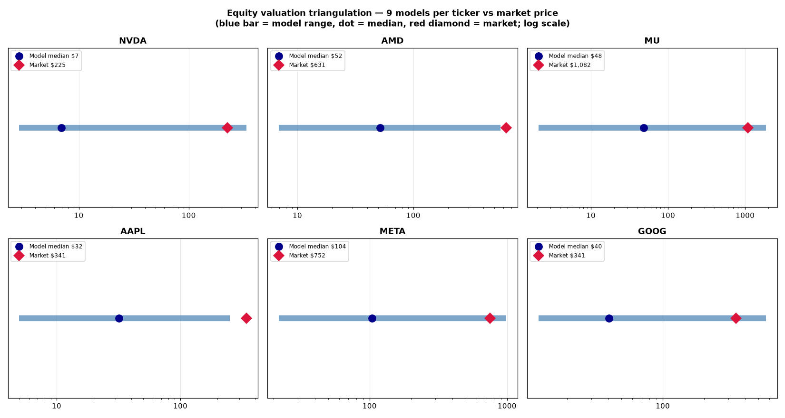

# Equity Valuation — 9 Models × 6 Mega-Caps

Equity valuation for **NVDA, AMD, MU, AAPL, META, GOOG** across three
valuation families — present value, relative multiples, and asset-based —
three models each. Built to show how the families disagree, and why the
honest answer is a range, not a point estimate.

Valuation date: **2026-09-25** · Risk-free rate **5.18%** (US 10Y ^TNX) ·
ERP 4.5% · cost of equity via CAPM (β from Yahoo Finance).

## The 9 models

**1. Present value** (discounted at cost of equity)
- **1a. Constant-growth DDM** — Gordon: V₀ = D₁/(kₑ−g), g capped at 5%
- **1b. Two-stage DDM** — 5 years at per-ticker dividend growth, then 3% stable
- **1c. FCFE model** — 5-year FCFE projection + Gordon terminal (2.75%)

**2. Multiplier / relative value** (peer medians)
- **2a. P/E comps** — median peer trailing P/E × TTM EPS
- **2b. P/B comps** — median peer P/B × book value per share
- **2c. EV/EBITA** — median peer EV/EBIT × company EBIT (≈ EBITA, amortization
  undisclosed) → EV → equity → per share

**3. Asset-based**
- **3a. Book value** — statement equity / diluted shares
- **3b. Liquidation** — distressed recovery schedule (cash 100%, receivables
  85%, inventory 55%, PPE 50%, goodwill/intangibles 0%) less all liabilities
- **3c. Replacement cost** — tangible assets restated (PPE @1.35×, other
  tangible non-current @1.15×) less liabilities

## Key results (US$/share)

| Model | NVDA | AMD | MU | AAPL | META | GOOG |
|---|---|---|---|---|---|---|
| 1a. Gordon DDM | 5.37 | N/A¹ | 5.46 | 21.97 | 38.17 | 15.85 |
| 1b. Two-stage DDM | 6.96 | N/A¹ | 6.33 | 18.29 | 45.29 | 21.07 |
| 1c. FCFE model | 61.18 | 51.70 | 2.10 | 94.22 | 265.09 | 142.06 |
| 2a. P/E comps | 334.28 | 163.48 | 1,852.39² | 251.32 | 842.72 | 564.88 |
| 2b. P/B comps | 94.23 | 562.71³ | 680.62 | 41.79 | 575.52 | 230.40 |
| 2c. EV/EBITA | 310.47 | 105.73 | 355.74 | 204.33 | 983.49 | 303.34 |
| 3a. Book value | 6.47 | 38.65 | 48.28 | 4.99 | 85.88 | 34.35 |
| 3b. Liquidation | 2.87 | 6.94 | 15.88 | −8.99⁴ | 21.92 | 12.40 |
| 3c. Replacement cost | 5.94 | 14.02 | 62.28 | 7.81 | 103.86 | 40.34 |
| **Market price** | **225.07** | **630.63** | **1,082.28** | **341.07** | **751.66** | **341.08** |

¹ AMD pays no dividend — DDM not applicable.
² MU's TTM EPS ($44.19) is a cyclical peak; peer P/E × peak earnings overstates.
³ AMD's book value is inflated by acquisition goodwill (Xilinx); P/B comps overstate.
⁴ AAPL's buybacks have thinned equity below a haircut asset base — liquidation is
genuinely negative: equity holders rely entirely on franchise value.



## What the disagreement means

- **Present-value models sit well below market** for all six — at CAPM
  discount rates of 10–16%, the market is pricing growth and risk the models
  don't grant.
- **Multiples mostly point the other way** — the market values these names
  like their peers, which are themselves richly priced.
- **Asset-based values anchor the downside** ($−9 to $104/share). The range
  *is* the conclusion: the families measure different things (cash
  distributions vs peer pricing vs asset claims).

## Assumptions (all editable)

- `assumptions/global.json` — ERP, terminal/stable growth, liquidation
  recovery schedule, replacement-cost multiples
- `assumptions/peers.json` — comparable-company sets per ticker
- `assumptions/<TICKER>.json` — dividend growth, FCFE growth, rationale

See `docs/findings.md` for the full report with per-ticker tables.

## Data sources

Yahoo Finance via `yfinance` (statements, prices, dividends, peer multiples).
No API key. Raw pulls: `data/raw/`.

## Re-run

```bash
python3 -m venv .venv && .venv/bin/pip install yfinance pandas numpy matplotlib
.venv/bin/python scripts/fetch_data.py   # refresh market data
.venv/bin/python scripts/run_all.py      # rebuild docs/
```

## Project structure

```
equity-valuation-models/
├── assumptions/          # global + peer sets + per-ticker growth assumptions
├── data/raw/             # yfinance pulls: 6 companies + peers + market snapshot
├── docs/
│   ├── findings.md       # full report
│   ├── comparison.csv    # 9 models × 6 tickers
│   └── charts/           # valuation-range triangulation chart
└── scripts/
    ├── fetch_data.py     # yfinance pull
    ├── models.py         # the 9 valuation engines
    └── run_all.py        # valuations → CSV, report, chart
```
